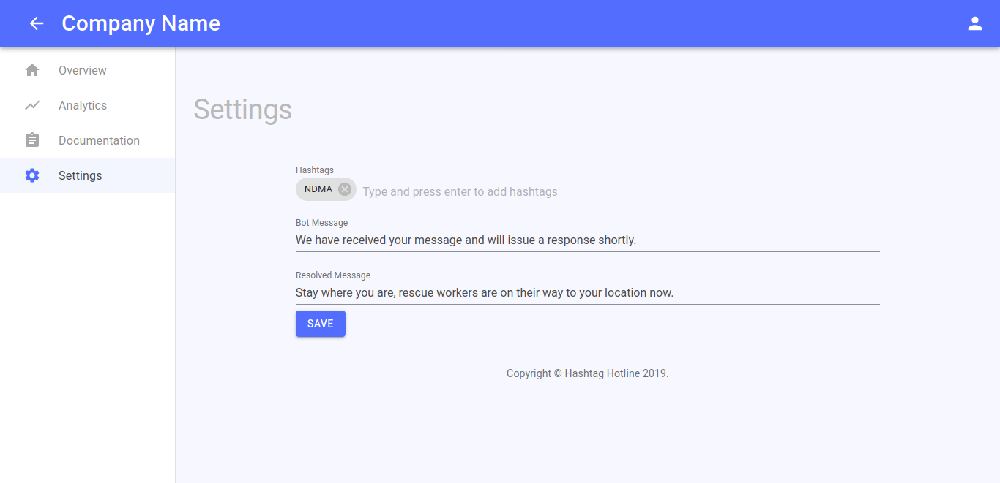
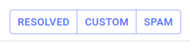
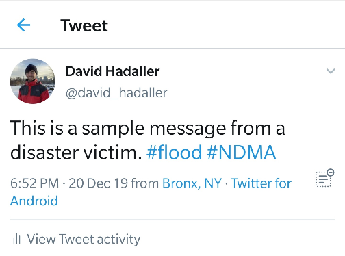
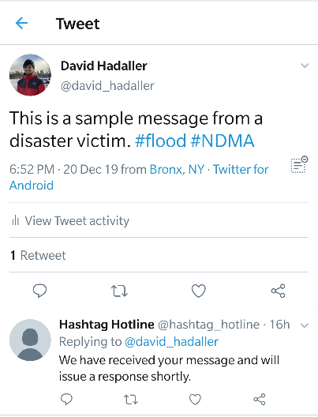
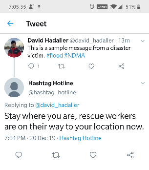
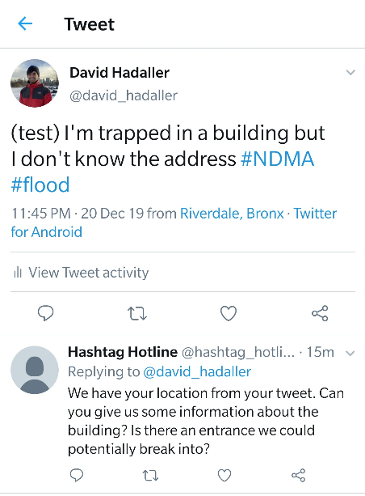
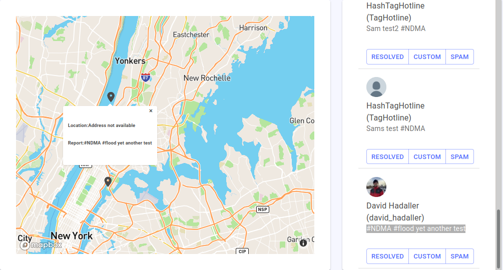
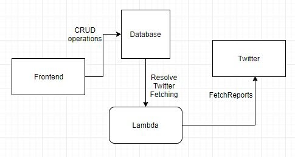

# HashTag HotLine

<a name="toc"/>

## Project Documentation Contents  
- [About This Project](#introduction) 
- [A Tour of Core Features](#core)
- [Installation](#install) 
- [Contributing to this Project](#contrib)
- [Tools and Libraries Used](#tools)

<a name="introduction"/>

## About This Project[↰](#toc)


HashTag Hotline is an online, location-based twitter communications application for NGO's in the [Global South](https://en.wikipedia.org/wiki/Global_South).  The idea is simple: during disasters,  disaster victims [already turn to Twitter](https://blog.twitter.com/en_in/a/2016/twitter-for-crisis-and-disaster-relief-in.html) to report emergencies during hurricanes, earthquakes, and other natural disasters. Hastag Hotline is a purpose-built  twitter client for NGO's  that helps them easily locate problems using location data, and  keep constant communication with victims over twitter.

![[speed output image]](README_images/ezgif-1-22fae63c1f7c.gif)

<a name="core"/>

## A Tour of Core Features[↰](#toc)


The project is hosted [here](https://master.d2nb81n0vt6kb5.amplifyapp.com). We present a brief overview of our core features in this readme; for additional information, click [here](https://hongzred.github.io/HashTag_HotLine/docs/index.html) for developer documentation.

### Filter

Upon login, the dashboard user, who is principally a call center worker/ respondent, will be greeted with a dashboard containing a Map, a Feed and a Filter. These components allow the dashboard user to narrow their focus to addressing tweets that contain a particular hashtag, or tweets localized to a particular geographic area. For example, you might want to filter tweets concerning flooding in one area, but electrical fires in another area.

Filtering is accomplished by the tag cloud component at the top of the dashboard. The blue tags on the bottom of the component are persistent tags that represent the "Hotline" hashtag a twitter user might respond to in the case of an emergency. The blue tags are persistent from login session to login session.  Meanwhile, the gray hashtags on the top row allow the dashboard user to filter through relevant tweets. Suppose National Disaster Management Authority (NDMA India) wants to examine tweets addressed to their hotline, but contain the keyword "flood". They simply add a tag to filter in the top row.

![[speed output image]](README_images/ezgif-1-f93acc3de791.gif)

### Feed

Afterwards the tweets will be updated in the feed component as seen here (notice how they all have tags #NDMA and #flood):

![[video-to-gif output image]](README_images/ezgif-1-12eed0724411.gif)

**NOTE:** If you would like to test this part of the application by tweeting from your own twitter account, turn on location services on your device and make sure the location is within the specified map area (in this case the 5 Borroughs of NYC.) Also, to see the responses from hashtag hotline, you must follow @hashtag_hotline, otherwise all responses will be hidden from view. The reason for this is that, early on in our project, we sent too many tweets at once using the channel to which our API keys are associated and so @hastag_hotline was flagged as a spammer bot by twitter.  

Notice the 3 buttons on the bottom of each tweet that read, "Resolved, Custom, Spam." These buttons allow dashboard users to issue automated and custom responses to disaster victims that can help keep victims constantly informed. 

Before moving on to the functionality of these buttons, it's worthwhile to discuss how the the settings page allows us to pre-set responses sent by these buttons. 

#### Settings

In the settings page, we have a "Hashtag" entry where the permanent "hotline hashtags" can be set. Then, we have a field for the "Bot Message," which is an automated response issued to *every* tweet that appears in the feed. There is no button that sends the Bot Message, instead a lambda twitter bot sends a message to each tweet that matches our filter criteria. The purpose of the Bot Message is to assure the disaster victim that their call for help has been heard.

 The "Resolved Message" field is an automated response that is issued when the "resolved" button is clicked in the feed interface. This message is meant to inform the disaster victim when help will be coming.




#### Feed Buttons & Bot Responses

Feed buttons (shown below) allow dashboard users  to answer the concerns of disaster victims in real time and ensure constant communication. In this section, we go over their functionality one  by one. Additionally, we discuss the Bot Response, which is a *completely* automated twitter response that requires no input on the part of the dashboard user.



### Bot Message Response

Suppose we receive the following tweet in our feed on our Hashtag Hotline Dashboard:



Then, in accordance with the Bot Response set in the settings page, the twitter user will see the following response on their device:




##### Resolved Button

Now we move to the **Resolved Button**, which is meant to inform the disaster victim when help will be coming. After clicking the Resolved button, the dashboard user is prompted with a message (shown in the gif below) confirming whether the Resolved Message should be be sent to the twitter user.

![[crop output image]](README_images/ezgif-1-b1bc7f9afb18.gif)

 If the dashboard user clicks send, then the twitter user will see a response to their tweet on their device:




##### Custom Response Button
Next, **Custom Responses** allow the dashboard user to interact with twitter users. Perhaps dashboard users need to get more information, or cater to the needs of a specific scenario faced by a particular user. In the example below, a disaster victim on twitter sends a tweet (with location data attached) but the twitter user is unfamiliar with their surroundings, and is trapped inside a building. The dashboard user responds asking for more information about the layout of the building and if there might be an entrance rescue workers can break into.

![[video-to-gif output image]](README_images/ezgif-1-33608c78c50c.gif)

The twitter user, in turn, would see the following response:



#### Spam Button

Finally, the spam button simply marks a specific tweet as spam so that it will not appear in the feed or be saved to DynamoDB.

###  Map
The map reads from the same global state as the twitter feed, and so all tweets that appear on the filter are also present on the map. This can help disaster workers pinpoint multiple calls for help within the same geographical area. 



<a name="install"/>

## Installation[↰](#toc)


After cloning this repository, reach out to one of the project maintainers, who should provide you with the following necessary configuration and keyfiles. All files, except the IAM credentials file,  should be copied into the directories in which they belong. The contents of the IAM credentials file will just be copy-pasted during the amplify setup process. Here are the files you should receive:
- an `aws-exports` file, which belongs in `/src/aws-exports`
- a `.env` file that belongs in the root folder of this project.
- a credentials file with an IAM username, access key, secret key id which you will copy and paste into the  terminal in the amplify setup section.

To install the project for yourself, you'll need a node development server. Install node with one of the installers listed [here](https://nodejs.org/en/download/). After that, you'll need to install and configure the [AWS Amplify Framework](https://aws.amazon.com/amplify/framework/).

### Amplify Setup

1. First, globally install the amplify command line utiltiy using `npm`, which comes with any node installation. 
   ```
   npm install -g @aws-amplify/cli
   ```

2. After amplify is installed
   
   - run `amplify configure` 
   - select your region (in our case, `us-east-1`) 
   - input the credentials (username, access key, secret key id) that have been provided to you by other project maintainers into the terminal.
   run 

3. Now, run `amplify init` and select the `development` environment;  this is the environment.

4. Finally run `amplify env pull` to ensure you have the right environmental settings on your local machine. 

### Start the server
After Amplify has been set up, you can finally start the development server. Before beginning, however, make sure that you have the latest chagnes from the github repo by running `git pull`. Also, make sure your node packages are up-to-date by running `npm install` in the root of the project directory. Finally, you can run `npm start` and the application should be accessible in the browser at url `localhost://3000.

### Tests


including unit tests, integration tests and e2e test

<a name="contrib"/>

## Contributing to this Project[↰](#toc)

Before contributing, you should be aware of Hashtag Hotline's technology stack and platform architecture. As is shown in the diagram below, we have a React front-end that communicates to DynamoDB Database through CRUD operations (which are graphQL utility functions defined in the files in `/src/crud`.)  All tweets that match the filters specified by the dashboard user are stored in the database, because records must be kept during emergency scenarios about who's calls for help were answered and who's weren't directly addressed (and why.) The lambda functions, which are defined in `/amplify/backend/function` are written locally and then pushed to aws lambda using amplify. It's these lambda functions that interact with the twitter api to fetch and respond to tweets.



If you see a feature that you would like to implement, fork this repository and make a detailed pull request. See Marc Diethelm's guide on [How to make a clean pull request](https://github.com/MarcDiethelm/contributing/blob/master/README.md) before making your first PR.

<a name="tools"/>

## Tools and Libraries Used[↰](#toc)

- [React](https://reactjs.org/docs/getting-started.html) (Including [React Context](https://reactjs.org/docs/context.html#___gatsby))
- [Material UI](https://material-ui.com/getting-started/installation/)
- [GraphQL](https://graphql.org/)
- [Amplify](https://aws-amplify.github.io/docs/cli-toolchain/quickstart),  [S3](https://docs.aws.amazon.com/AmazonS3/latest/dev/Welcome.html) , [DynamoDB](https://docs.aws.amazon.com/amazondynamodb/latest/developerguide/Introduction.html), [Lambda](https://docs.aws.amazon.com/lambda/latest/dg/getting-started.html)
- [Husky](https://github.com/typicode/husky#readme)
- [JSDoc](https://github.com/jsdoc/jsdoc#readme)
